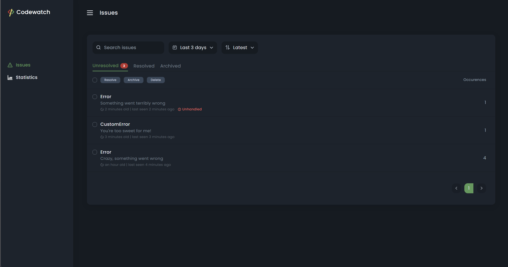
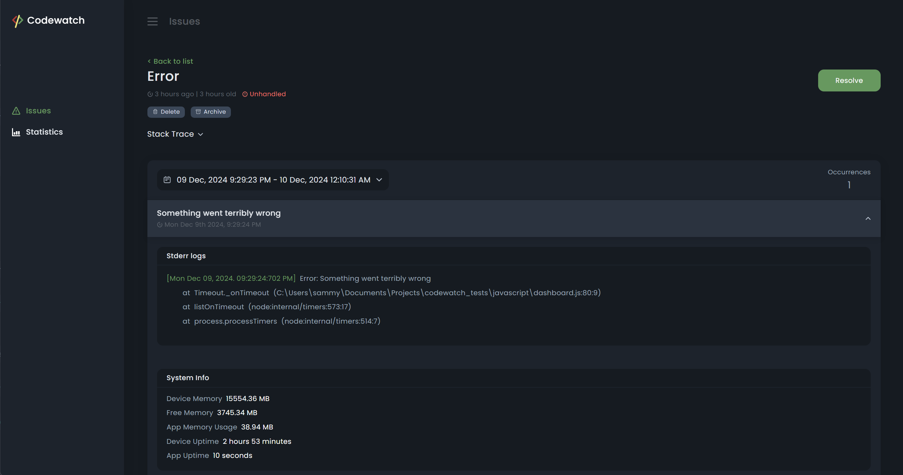

# Codewatch

Codewatch is an error monitoring and log management system that captures errors, uncaught exceptions, unhandled promise rejections, and additional data, providing a beautiful dashboard for effective debugging and monitoring.





## Features

- **Error Capture:** Monitors and captures errors, including unhandled exceptions and promise rejections.
- **Log Management:** Tracks recent logs from stdout and stderr with customizable retention periods.
- **Custom Data Capture:** Records custom metadata associated with application events or states.
- **System Information:** Includes system and application runtime metrics in captured data.
- **Transaction-Safe Storage:** Uses a storage backend for transactional data recording.

## Installation

1. cd into the root directory of your project.
2. Run the following command:

```bash
  npx codewatch-installer install
```

3. Follow the prompts to select and install the appropriate plugins depending on your project's stack.

## Usage/Examples

This example assumes a project that uses Express.js and a PostgreSQL database.

### Initialization

```javascript
import { captureError, init } from "codewatch-core";
import { ExpressAdapter } from "codewatch-express";
import { CodewatchPgStorage } from "codewatch-postgres";
import express from "express";

const app = express();

// Initialize the storage plugin with the database credentials
const storage = new CodewatchPgStorage({
  user: "USER_NAME",
  host: "HOST",
  database: "DATABASE_NAME",
  password: "DATABASE_PASSWORD",
  port: 5432, // Please replace all these details with your actual details.
});

// Initialize the web framework adapter and set a base path
const basePath = "/code";
const adapter = new ExpressAdapter();
adapter.setBasePath(basePath);

// Initialize codewatch with the storage plugin and the adapter
init({
  storage,
  serverAdapter: adapter,
});

// Add a middleware on the specified base path to access the dashboard
const router = adapter.getRouter();
app.use(basePath, router);

// ...the rest of your server setup

const port = 3000;
app.listen(port, () => {
  console.log(`Server listening on port ${port}`);
  console.log(`Dashboard available at http://localhost:${port}${basePath}`);
});
```

That's it! Now you can visit http://localhost:3000/code to access the dashboard.

You can find more examples such as:

- [with-express](./examples/with-express/)
- [with-nestjs](./examples/with-nestjs/)

in the [examples](./examples/) folder.

### Capturing Errors

Capture an error explicitly:

```javascript
import { captureError } from "codewatch-core";

try {
  throw new Error("Something went wrong");
} catch (err) {
  captureError(err);
}
```

### Custom Data Capture

Record custom metadata:

```javascript
import { captureData } from "codewatch-core";

captureData(
  { foo: "bar" },
  { name: "SomeDataILog", message: "This is some data I captured" }
);
```

### Configuration Options

The `init` function also accepts the following configuration options:

| Option                   | Type    | Default | Description                                         |
| ------------------------ | ------- | ------- | --------------------------------------------------- |
| `disableConsoleLogs`     | boolean | `false` | Disables capturing logs from `stdout` and `stderr`. |
| `stdoutLogRetentionTime` | number  | `5000`  | Retention period for `stdout` logs (in ms).         |
| `stderrLogRetentionTime` | number  | `5000`  | Retention period for `stderr` logs (in ms).         |

## License

[MIT](https://choosealicense.com/licenses/mit/)
